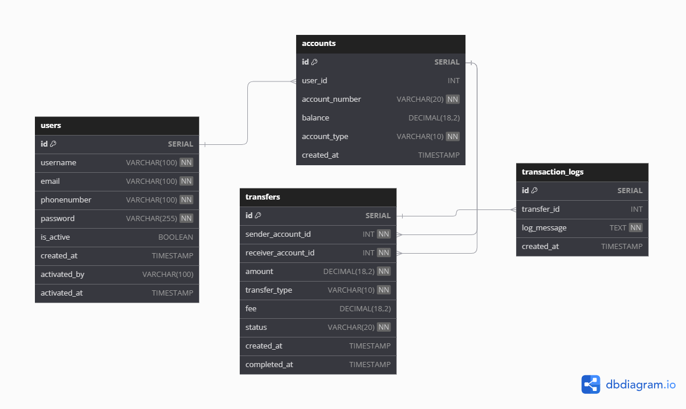

# AMARA-BANK-DIGITAL-BISNIS

<ul>
<li>Nama : Kukuh Wicaksono</li>
<li>Proyek Akhir Bootcamp Golang Batch 59</li>
</ul>

### Resource:
<ul>
<li>Github : https://github.com/cfra321/Amar-Bank-Digital-Bisnis</li>
<li>Deploy Railway : [Railway Deployment Link]</li>
<li>Documentation Postman : [Postman Documentation Link]</li>
<li>PPT : [Google Slides Link]</li>
</ul>

### ERD
Sistem ini memiliki tabel-tabel berikut:
<ul>
<li>Tabel users</li>
<li>Tabel accounts</li>
<li>Tabel transactions_log</li>
<li>Tabel transfer</li>
</ul>

### API
Sistem ini memiliki berbagai endpoint sebagai berikut:

## Endpoint Main
Endpoint utama.
Method | Path | Keterangan | Auth
------------- | ------------- | ------------- | -------------
***GET*** | *`/`* | Menampilkan identitas pembuat API | -

## Endpoint Auth
Endpoint ini menangani autentikasi pengguna.
Method | Path | Keterangan | Auth
------------- | ------------- | ------------- | -------------
***POST*** | *`/api/auth/login`* | Menghasilkan token autentikasi | -
***POST*** | *`/api/register`* | Mendaftarkan pengguna baru | -

## Endpoint Users
Endpoint ini mengelola akun pengguna, termasuk registrasi, pembaruan status, pengambilan data, dan penghapusan pengguna.

Method | Path | Keterangan | Auth
------------- | ------------- | ------------- | -------------
***PUT*** | *`/api/users/:id/status`* | Mengupdate status aktif pengguna berdasarkan ID | token
***GET*** | *`/api/users`* | Mengambil data semua pengguna | token
***GET*** | *`/api/users/:id`* | Mengambil data pengguna berdasarkan ID | token
***DELETE*** | *`/api/users/:id`* | Menghapus pengguna berdasarkan ID | token

## Endpoint Accounts
Endpoint ini mengelola account bank user.
Method | Path | Keterangan | Auth
------------- | ------------- | ------------- | -------------
***POST*** | *`/api/accounts`* | Membuat akun baru | token
***GET*** | *`/api/accounts/{account_id}`* | Mendapatkan detail akun | token
***GET*** | *`/api/accounts`* | Mendapatkan semua akun | token
***GET*** | *`/api/accounts/account-number/{account_number}`* | Mendapatkan akun berdasarkan nomor | token

## Endpoint Transactions
Endpoint ini mengelola transaksi keuangan.
Method | Path | Keterangan | Auth
------------- | ------------- | ------------- | -------------
***POST*** | *`/api/transactions/deposit`* | Menyetor dana ke akun | token
***POST*** | *`/api/transactions/withdraw`* | Menarik dana dari akun | token
***POST*** | *`/api/transactions/transfer`* | Melakukan transfer antar akun | token

## Endpoint Reporting
Endpoint ini menghasilkan laporan log mutasi transfer.
Method | Path | Keterangan | Auth
------------- | ------------- | ------------- | -------------
***GET*** | *`/api/reports/generate`* |  mutasi transfer | token

